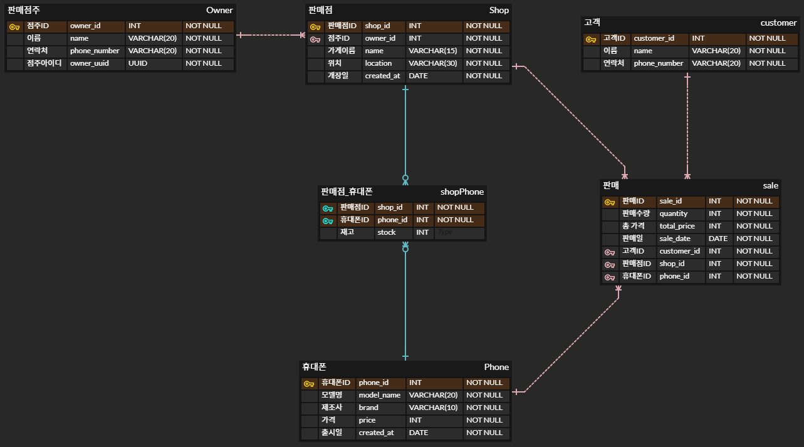

<h1 align="center>유레카 미니프로젝트</h1>

---

### 📋 목차

1. [프로젝트 소개](#프로젝트-소개)
2. [기술 스택](#기술-스택)
3. [프로젝트 기능](#프로젝트-기능)
4. [ERD](#erd)
5. [실행 화면](#실행-화면)
6. [느낀 점](#느낀-점)
---

### 📝 프로젝트 소개
가맹점 점주가 `휴대폰 재고`, `판매 내역`, `매출 통계`를 효율적으로 관리할 수 있는 시스템

### 💻 기술 스택

### 🎨 ERD

### ⚙️ 프로젝트 기능

### 📸 실행 화면
