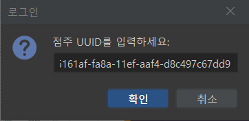
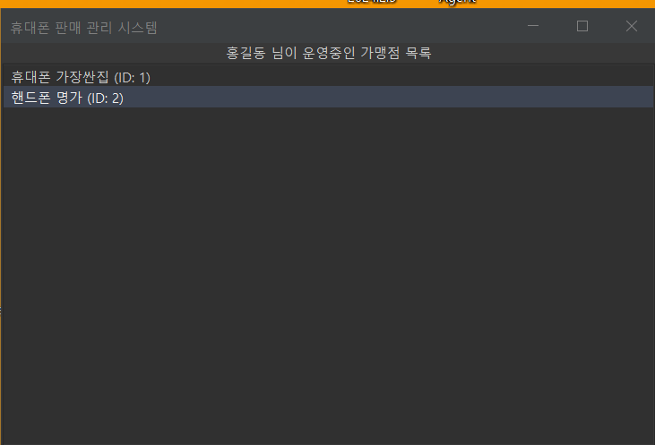
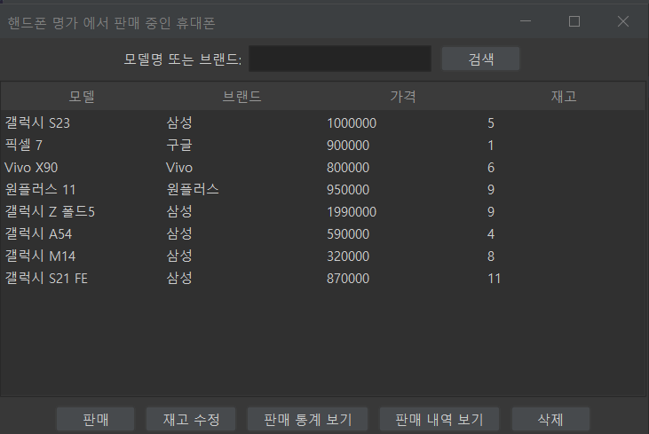
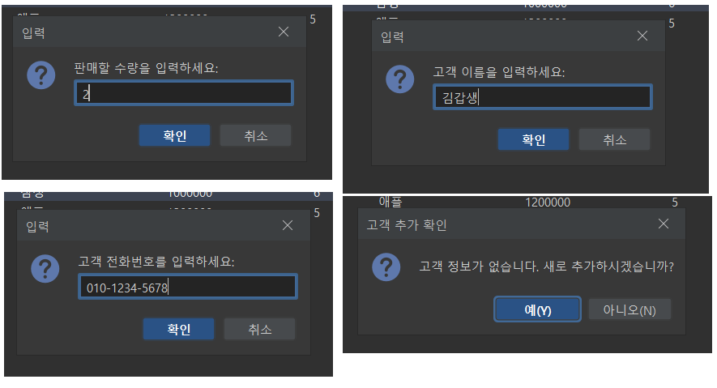
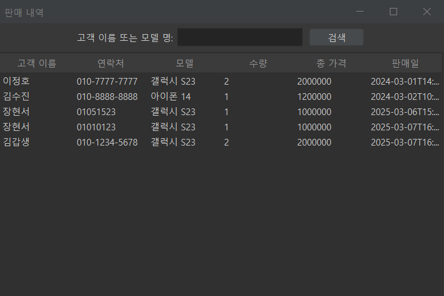
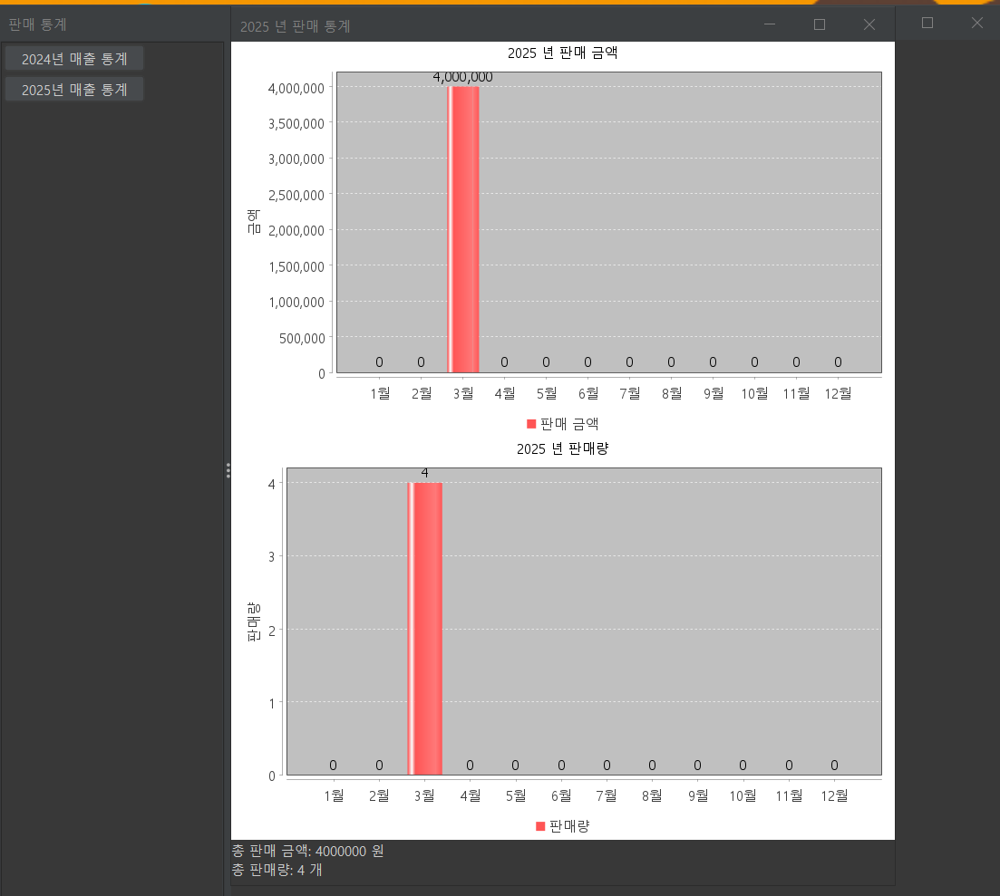

# 
유레카 미니프로젝트

## 📋 목차

1. [프로젝트 소개](#-프로젝트-소개)
2. [기술 스택](#-기술-스택)
3. [ERD](#-ERD)
4. [프로젝트 기능](#-프로젝트-기능)
5. [실행 화면](#-실행-화면)

## 📝 프로젝트 소개
가맹점 점주가 `휴대폰 재고`, `판매 내역`, `판매 통계`를 효율적으로 관리할 수 있는 시스템

 

## 💻 기술 스택

 

## 🎨 ERD

 

## ⚙️ 프로젝트 기능

| 기능                 | 설명                                   |
|----------------------|--------------------------------------|
| 가맹점 관리           | UUID로 가맹점을 조회하고 선택하여 판매 중인 휴대폰 목록 확인 |
| 휴대폰 판매           | 휴대폰 선택 후 수량, 고객 정보 입력하여 판매, 판매 내역 기록 |
| 재고 및 판매 내역 관리 | 판매 후 재고 자동 업데이트, 재고 및 판매 내역 확인       |
| 재고 수정             | 점주가 재고 수량을 수정 및 재고가 없는 휴대폰 삭제        |
| 판매 통계 확인        | 전체 판매 수량, 금액 총합, 월별 판매 추이를 그래프로 확인   |

## 📸 실행 화면
| 점주마다 점주 코드로 로그인 |
|-----------------|
|  |

| 운영중인 가맹점 목록 조회          | 가맹점에서 판매중인 휴대폰 목록 조회          |
|-------------------------|-------------------------------|
|  |  | 

| 판매시 수량 및 고객정보 입력    |
|---------------------|
|  |

| 판매 내역 확인                      |
|-------------------------------|
|  |

| 판매 통계 확인                      |
|-------------------------------|
|  |