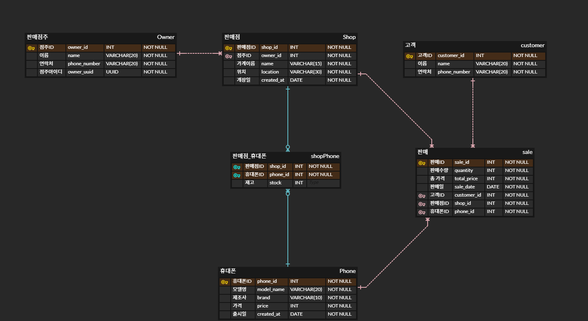

<h1 class="center-text">유레카 미니프로젝트</h1>

---

## 📋 목차

1. [프로젝트 소개](#프로젝트-소개)
2. [기술 스택](#기술-스택)
3. [프로젝트 기능](#프로젝트-기능)
4. [ERD](#erd)
5. [실행 화면](#실행-화면)
6. [느낀 점](#느낀-점)

## 📝 프로젝트 소개

---

가맹점 점주가 `휴대폰 재고`, `판매 내역`, `매출 통계`를 효율적으로 관리할 수 있는 시스템

 

## 💻 기술 스택

---

 

## 🎨 ERD

---

 

## ⚙️ 프로젝트 기능

---

| 기능                 | 설명                                 |
|----------------------|------------------------------------|
| 가맹점 관리           | UUID로 가맹점을 조회하고 선택하여 판매 중인 휴대폰 목록 확인 |
| 휴대폰 판매           | 휴대폰 선택 후 수량, 고객 정보 입력하여 판매, 판매 내역 기록 |
| 재고 및 판매 내역 관리 | 판매 후 재고 자동 업데이트, 재고 및 판매 내역 확인     |
| 재고 수정             | 점주가 재고 수량을 수정할 수 있음                |
| 판매 통계 확인        | 전체 판매 수량, 금액 총합, 월별 판매 추이를 그래프로 확인 |

## 📸 실행 화면

---
